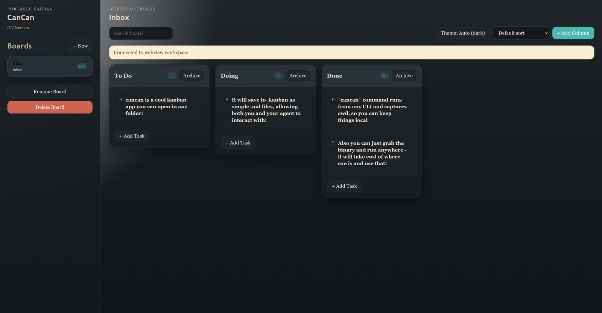

# CanCan



CanCan is a small local issue tracker and kanban app that lives inside the folder you are already working in.

Current release version: `v0.1.1`

It exists for one very specific workflow: you want a clean UI for managing tasks, but you also want the underlying data to stay local, readable, and editable by both humans and coding agents.

## What It Does

- Runs as `cancan` from any folder
- Treats your current working directory as the active workspace
- Stores boards as markdown files in `.kanban/boards/`
- Keeps the board format readable enough for direct editing
- Gives you a dedicated UI for boards, columns, tasks, tags, dates, priorities, workload, and steps
- Lets agents collaborate by reading and editing the same files you use manually

## Why It Exists

Most issue trackers are either too heavy, too remote, or too opaque.

CanCan is meant to stay close to the work:

- local to the project folder
- portable across repositories and experiments
- easy to inspect in plain text
- practical for agent-assisted workflows

Instead of hiding state in a database or remote service, CanCan keeps your task system beside your code.

## How It Works

When you run `cancan` inside a folder, CanCan creates and uses:

- `.kanban/config.json`
- `.kanban/boards/*.md`

The app uses Luminka detached-root mode, so the folder you launch from becomes the active workspace. That means each project can have its own local board set without extra configuration.

Board files are markdown-first and include metadata to help agents preserve the expected structure while editing.

## Install

Release builds are produced by GitHub Actions for:

- Windows amd64
- Linux amd64 and arm64
- macOS amd64 and arm64

Release publishing is triggered by pushing a tag that matches `v*`, currently `v0.1.1`.

Use one of these install commands.

### PowerShell

```powershell
irm "https://raw.githubusercontent.com/lirrensi/cancan/main/scripts/install.ps1" | iex
```

### macOS / Linux

```bash
curl -fsSL "https://raw.githubusercontent.com/lirrensi/cancan/main/scripts/install.sh" | sh
```

The installer downloads the latest release for your platform, installs `cancan` into a user-local bin directory, and adds that directory to your `PATH` if needed.

## Usage

```bash
cancan
```

Run it inside any project folder. CanCan opens the board UI for that folder and keeps its data under `.kanban/` there.

## Build From Source

### Windows webview build

`build.bat` is preconfigured for MSYS2 MinGW at `C:\msys64\mingw64\bin\gcc.exe` and embeds the Windows icon from `winres/icon.png` before building `cancan.exe`.

### Browser-mode build

`build_browser.bat` builds the browser-launching variant.

## Collaboration Model

CanCan is designed so you can:

- manage tasks visually in the UI
- inspect or edit board files directly
- let an agent update the same markdown files without inventing a separate format

This makes it useful as a lightweight local planning layer for coding projects.

## Acknowledgements

- Built on top of [`Luminka`](https://github.com/lirrensi/luminka), a lightweight Electron/Tauri alternative for local desktop apps
- Frontend code and board workflow are based on [`markdown-kanban`](https://github.com/holooooo/markdown-kanban)
